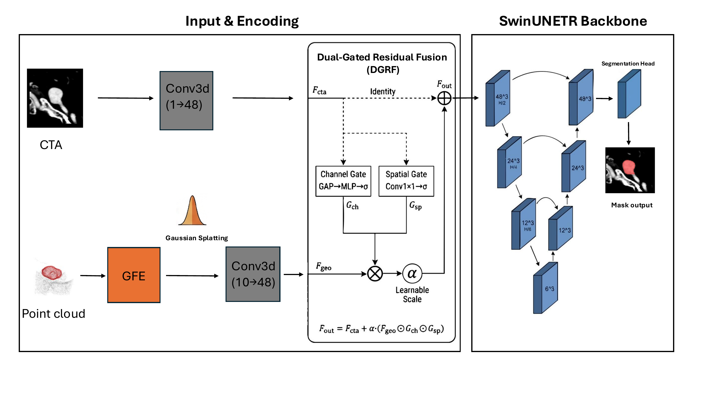
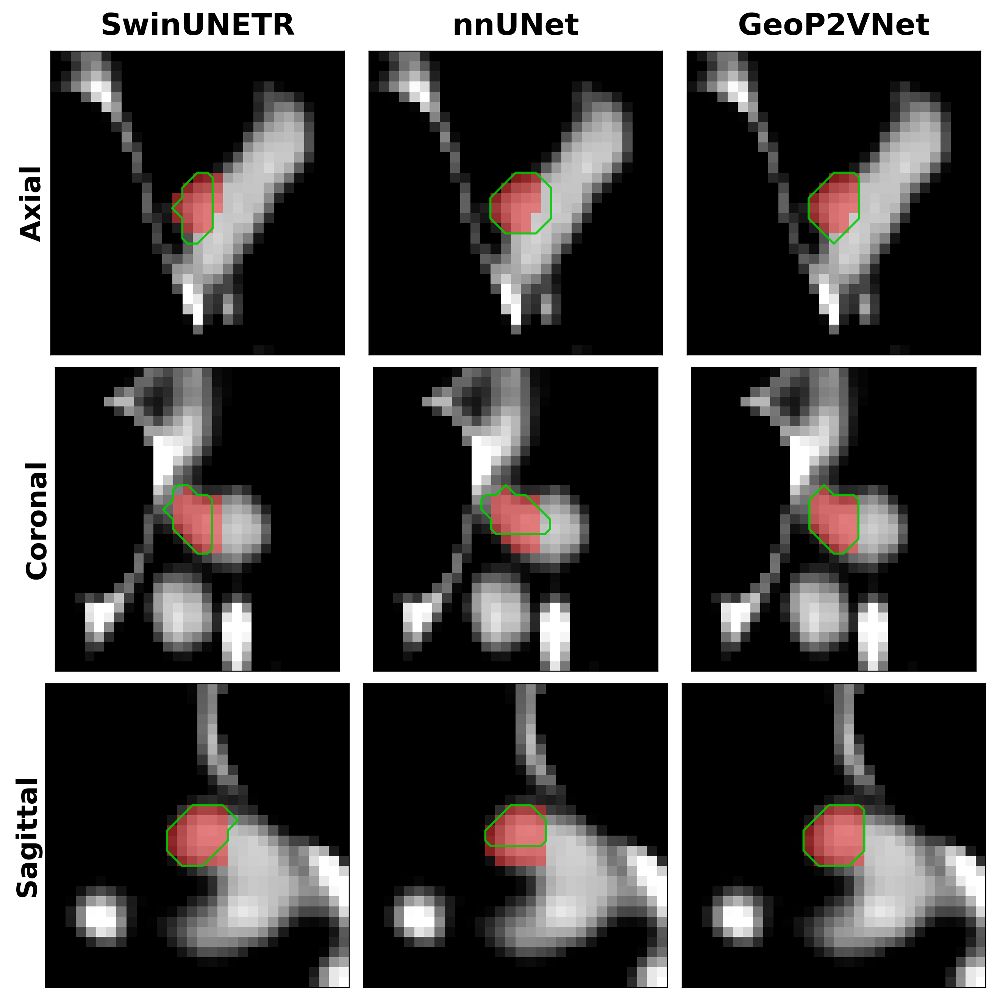
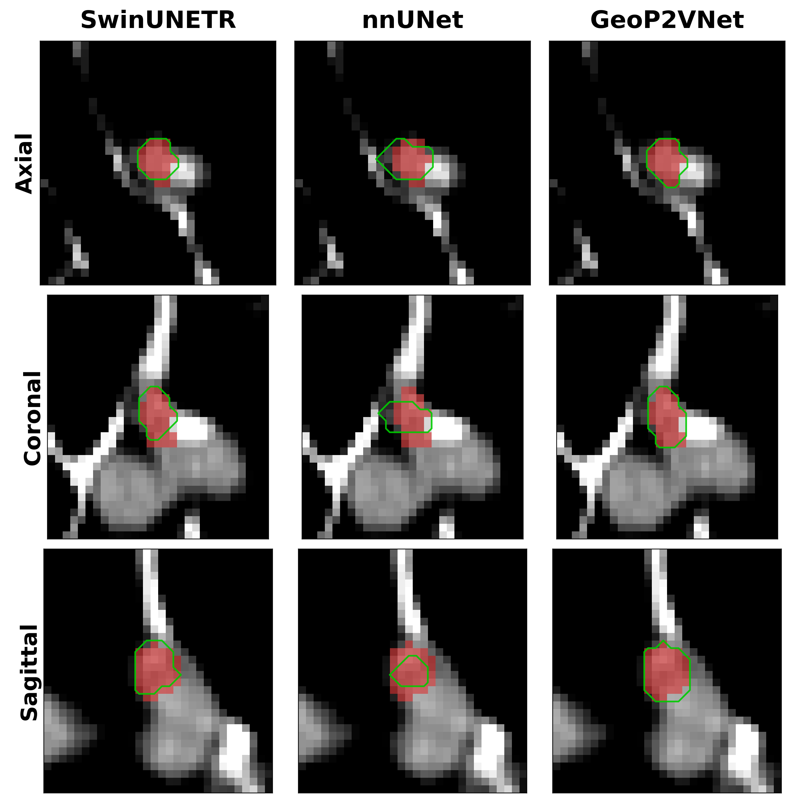
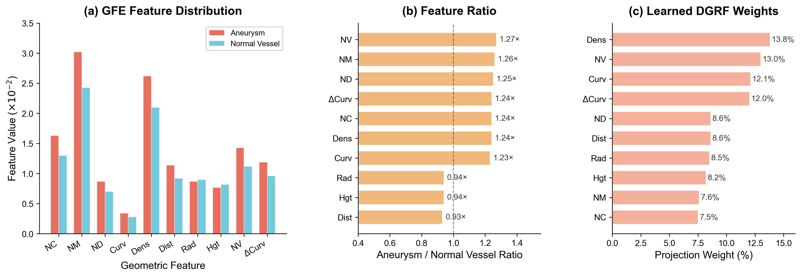

# GeoP2VNet

Official PyTorch implementation of **Geometry-Aware Point-to-Voxel Fusion via Gaussian Splatting for Intracranial Aneurysm Segmentation**.

GeoP2VNet addresses fine-grained intracranial aneurysm segmentation in CTA by coupling voxel intensity cues with explicit vessel-surface geometry. From each CTA patch and its vessel point cloud, the model extracts handcrafted geometric descriptors, maps them to the voxel grid through Gaussian splatting, and injects the projected geometry into a Swin-UNETR backbone with Dual-Gated Residual Fusion (DGRF).

This release includes the model implementation, data preparation utilities, training and inference scripts, configuration files, and figures used in the project page.

## Method



GeoP2VNet has three main modules. **Geometric Feature Extraction (GFE)** computes 10-D rotation-invariant descriptors from vessel-surface point clouds, including normal consistency, curvature, density, and normal variation. **Point-to-Voxel Gaussian Splatting (P2V)** projects sparse point features into a CTA-aligned dense voxel grid while preserving sub-voxel continuity. **Dual-Gated Residual Fusion (DGRF)** uses CTA-guided channel and spatial gates to amplify useful geometric priors near anatomically important regions and suppress noise from normal vessels.

## Results

The following tables reproduce the main quantitative results reported in the paper. Results are based on 205 CTA cases with 266 lesions under 5-fold cross-validation.

<table>
  <thead>
    <tr>
      <th colspan="6" align="left">Quantitative Comparison</th>
    </tr>
    <tr>
      <th align="left">Method</th>
      <th align="right">DSC ↑</th>
      <th align="right">IoU ↑</th>
      <th align="right">HD95 ↓</th>
      <th align="right">Recall ↑</th>
      <th align="right">FPs/case ↓</th>
    </tr>
  </thead>
  <tbody>
    <tr>
      <td>SwinUNETR</td>
      <td align="right">0.578&nbsp;±&nbsp;0.044</td>
      <td align="right">0.470&nbsp;±&nbsp;0.039</td>
      <td align="right">3.76&nbsp;±&nbsp;0.96</td>
      <td align="right">75.00&nbsp;±&nbsp;5.24</td>
      <td align="right">0.317&nbsp;±&nbsp;0.09</td>
    </tr>
  </tbody>
  <tbody>
    <tr>
      <td>nnU-Net</td>
      <td align="right">0.663&nbsp;±&nbsp;0.037</td>
      <td align="right">0.547&nbsp;±&nbsp;0.036</td>
      <td align="right">3.63&nbsp;±&nbsp;0.84</td>
      <td align="right">96.15&nbsp;±&nbsp;2.42</td>
      <td align="right">0.122&nbsp;±&nbsp;0.05</td>
    </tr>
  </tbody>
  <tbody>
    <tr>
      <td><strong>GeoP2VNet</strong></td>
      <td align="right"><strong>0.770&nbsp;±&nbsp;0.024</strong></td>
      <td align="right"><strong>0.652&nbsp;±&nbsp;0.026</strong></td>
      <td align="right"><strong>1.25&nbsp;±&nbsp;0.32</strong></td>
      <td align="right"><strong>98.08&nbsp;±&nbsp;1.80</strong></td>
      <td align="right"><strong>0.024&nbsp;±&nbsp;0.02</strong></td>
    </tr>
  </tbody>
  <tbody>
    <tr>
      <td colspan="6">&nbsp;</td>
    </tr>
  </tbody>
  <thead>
    <tr>
      <th colspan="6" align="left">Ablation Study</th>
    </tr>
    <tr>
      <th align="left">Variant</th>
      <th align="right">DSC ↑</th>
      <th align="right">IoU ↑</th>
      <th align="right">HD95 ↓</th>
      <th align="right">Recall ↑</th>
      <th align="right">FPs/case ↓</th>
    </tr>
  </thead>
  <tbody>
    <tr>
      <td>Baseline</td>
      <td align="right">0.578&nbsp;±&nbsp;0.044</td>
      <td align="right">0.470&nbsp;±&nbsp;0.039</td>
      <td align="right">3.76&nbsp;±&nbsp;0.96</td>
      <td align="right">75.00&nbsp;±&nbsp;5.24</td>
      <td align="right">0.317&nbsp;±&nbsp;0.093</td>
    </tr>
  </tbody>
  <tbody>
    <tr>
      <td>w/o Gating</td>
      <td align="right">0.591&nbsp;±&nbsp;0.040</td>
      <td align="right">0.475&nbsp;±&nbsp;0.038</td>
      <td align="right">3.42&nbsp;±&nbsp;0.76</td>
      <td align="right">84.62&nbsp;±&nbsp;4.38</td>
      <td align="right">0.195&nbsp;±&nbsp;0.054</td>
    </tr>
  </tbody>
  <tbody>
    <tr>
      <td><strong>Full&nbsp;GeoP2VNet</strong></td>
      <td align="right"><strong>0.770&nbsp;±&nbsp;0.024</strong></td>
      <td align="right"><strong>0.652&nbsp;±&nbsp;0.026</strong></td>
      <td align="right"><strong>1.25&nbsp;±&nbsp;0.32</strong></td>
      <td align="right"><strong>98.08&nbsp;±&nbsp;1.80</strong></td>
      <td align="right"><strong>0.024&nbsp;±&nbsp;0.021</strong></td>
    </tr>
  </tbody>
</table>

## Qualitative Examples

<p align="center">
  
  
</p>

## Feature Analysis



The feature analysis shows that aneurysm regions exhibit stronger geometric responses than normal vessel regions for several descriptors. DGRF assigns larger weights to discriminative descriptors such as density, normal variation, and curvature, supporting the role of explicit surface geometry in small-lesion boundary refinement.

## Installation

```bash
git clone https://github.com/somtiannes/GeoP2VNet.git
cd GeoP2VNet
pip install -r requirements.txt
pip install -e .
```

The code was developed with Python 3.9+ and PyTorch 2.x. CUDA-enabled PyTorch is recommended for training.

## Data Format

Due to patient privacy restrictions, the clinical CTA dataset is not included. The code expects the following prepared directory structure:

```text
data/aneurysm_dataset/
  images/
    case001.nii.gz
  masks/
    case001_mask.nii.gz
  pointclouds/
    case001_points.npy
  train.txt
  val.txt
```

Each point-cloud file should contain an `N x 3` NumPy array of vessel-surface voxel coordinates.

To prepare data from CTA images, aneurysm masks, and vessel masks:

```bash
python scripts/prepare_full_dataset.py \
  --source_dirs /path/to/source_dir_1 /path/to/source_dir_2 \
  --output_dir data/aneurysm_dataset
```

## Training

Edit the paths in a config file, then run:

```bash
python tools/train.py --config configs/full_train.yaml --gpus 0
```

For multi-GPU training:

```bash
CUDA_VISIBLE_DEVICES=0,1,2 torchrun --nproc_per_node=3 tools/train.py --config configs/full_train.yaml
```

## Inference

```bash
python tools/inference.py \
  --config configs/full_train.yaml \
  --checkpoint /path/to/checkpoint.pth \
  --image /path/to/case.nii.gz \
  --pointcloud /path/to/case_points.npy \
  --output /path/to/prediction.nii.gz
```

## License

The source code is released under the Apache License 2.0. Paper text, figures, and tables included in this repository are provided for reference and are not covered by the software license unless explicitly stated otherwise.
